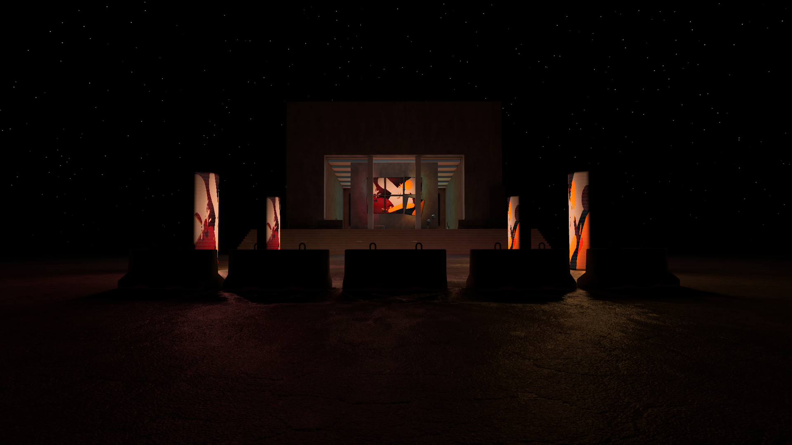
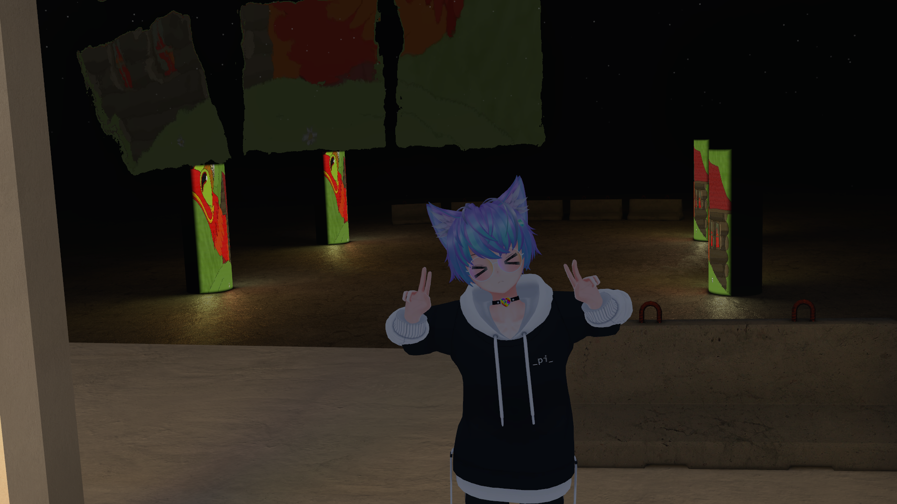
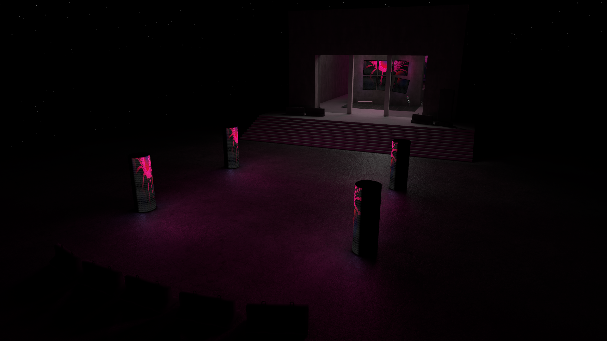
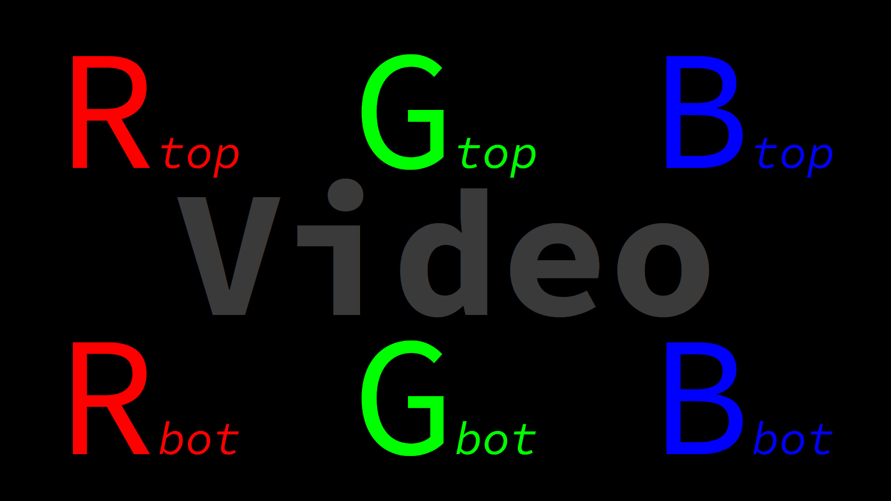

# Outdated - Use LTCGI instead

[LTCGI](https://github.com/pimaker/ltcgi)

## GI Joe - Fake realtime GI for VRChat video players

Lightmap-based fake realtime GI, i.e. light emissions from a video player that affect the world. Uses multiple Bakery SH-directional lightmaps to provide full normal mapping and baked specular highlights.

Shader code is based on (a now outdated version of) [z3y's PBR shader](https://github.com/z3y/shaders). It includes some other changes (e.g. fake realtime reflection, not explained here), but the most important part is [this function](https://github.com/PiMaker/gi-joe/blob/f0690d3a9f851c858d7348909775c8ddd69e5ed5/z3y/shaders/Shaders/lit/Bakery.cginc#L334).

**NOTE:** Due to the complex and hacky/tech-demo nature of this I will not help you make it work in your world, though you're free to do so because of the MIT license. While you're at it, you may want to check out my [other, supported prefabs](https://github.com/PiMaker/VRChatUnityThings) :)

Showcase world: https://vrchat.com/home/launch?worldId=wrld_f7724ef4-34f0-4beb-a46b-9f85059ebb1f

Dependencies:
* Bakery
* For AVPro: [lox9973's VideoRT](https://drive.google.com/file/d/1XQBybXg2D87AueLI87UuujA3jDN4fU33/view)

## Screenshots

## Usage instructions

Create an empty GameObject in your world and give it a tag called "GIJoe". Underneath, place two more empty objects called "0" and "1".

Two faking lightmaps will be calculated on bake: A "top" and a "bottom" one. These correspond to "0" and "1" respectively. These are then further split into RGB-based triple maps in left-to-right order, e.g. the red channel of the "top" lightmap represents the top left square in a 3x2 configuration. The video will then be sampled in those 6 positions at runtime to figure out the correct color for each of the "six" lightmaps (2 lightmaps with 3 channels each). See the figure below:

I like to use two planes, one located under "0" and one under "1" that are placed accordingly over the video player and are given a simple Unity Standard shader material with a 3x1 px texture containing only a full red, full green, and full blue pixel assigned as "Emission" (set intensity to 2 or 3 for a good effect). Since emissives will be baked by Bakery as area lights, this achieves good quality for simple rectangular video players. But nothing is stopping you from putting any combination of emissive or even bakery point light components under the "0" and "1" GIJoe components to bake the dynamic lightmaps however you want.

Once set up, you can trigger a bake by selecting "GIJoe bake" in the "Bakery" tab in the menu bar. Make sure to set up the regular Bakery configuration first, just like you normally would (*important:* you need to enable "Directional Mode: SH"!). Select which bakes you want to trigger in the popup and put any emissive materials that you do *not* want to show up in the dynamic lightmaps in the corresponding array slot. Then hit bake, lean back, relax, get a coffee, because that'll take a while.

Once done, you need to assign the dynamic lightmaps and video render texture to all materials that should use it. Select your material (with "z3y/lit" shader selected) and enable "GIJoe" under baked lighting. Either drag and drop all base and SH (they're still called "RNM" for some reason) lightmaps into their correct slots, or type in the correct names and hit "Auto-Fill". Put in the video render texture from VideoRT or your Unity Video Player output. The static lightmaps will be assigned automatically on building, but can be filled in manually as well (useful for in-editor testing). Make sure to set the "Bakery Mode" to "SH" if you do it manually. *Tip:* The z3y shader editor supports multi-editing.

## Disclaimer and important note for using

The baking script is a little bit broken. It sometimes doesn't quite put the lightmaps in the right places, or doesn't mark them as "Lightmap" (and "Directional Lightmap") asset types, causing them to be imported wrong (e.g. enables sRGB import mode, wrong compression, etc...). You need to fix this up manually after every bake for now, if you have a fix, feel free to send a PR or maintain your own fork :)

## License

MIT. See LICENSE.md.
